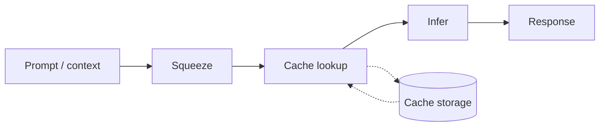

# Cheeserag

This repository wires a **local RAG stack** using three submodules:

| Component | Role |
|-----------|------|
| [cheesebrain](https://github.com/pomagrenate/cheesebrain) (`cheese-server`) | `/v1/chat/completions` + `/v1/embeddings` — use **`--embeddings --pooling mean`** (or `cls`/`last`); else 501 (no embeds) or 400 (pooling `none` vs OAI) |
| [pomaidb](https://github.com/pomagrenate/pomaidb) | Embedded vector store (RAG membrane); accessed via the Python `pomaidb` package and `libpomai_c` |
| [cheesepath](https://github.com/pomagrenate/cheesepath) (Go module `github.com/AutoCookies/crabpath`) | Agent (`ReAct`) with a custom **`rag_retrieve`** tool |

The **RAG facade** is a small Python HTTP service in [`rag_facade/`](rag_facade/) that calls Cheesebrain for embeddings and PomaiDB for storage/search. The Go binary [`cmd/cheeserag-agent`](cmd/cheeserag-agent/) points the LLM client at Cheesebrain and registers `rag_retrieve` against that facade.

### What “RAG” means here

**Real RAG in this project** is **PomaiDB + ingest/retrieve + the agent** (Cheesepath with `rag_retrieve`). The vector store and chunk text live in PomaiDB; the agent decides when to retrieve and then answers using Cheesebrain as the **LLM**. **Cheesebrain alone** is only inference + `/v1/embeddings` — it does **not** store your knowledge base or perform retrieval-augmented answers by itself.

If you only run `cheese-server` (or the Web UI) and chat, that is **plain chat**, not the PomaiDB-backed RAG pipeline.

### Build prerequisites

1. **PomaiDB** — init submodules (includes `palloc`), then build `libpomai_c.so`:

   ```bash
   git submodule update --init --recursive third_party/pomaidb
   cd third_party/pomaidb
   cmake -S . -B build -DCMAKE_BUILD_TYPE=Release
   cmake --build build -j"$(nproc)"
   ```

   Set `POMAI_C_LIB` to the absolute path of `third_party/pomaidb/build/libpomai_c.so` (see `third_party/pomaidb/README.md` for tests and options).

   If `git submodule update --init --recursive` (whole repo) fails on a missing `models/ggml-vocabs` entry, init **only** `third_party/pomaidb` as above, or fix/remove that stray gitlink in your tree.
2. **Cheesebrain** — build `cheese-server` once:

   ```bash
   cd third_party/cheesebrain
   cmake -S . -B build -DCMAKE_BUILD_TYPE=Release -DCHEESE_BUILD_SERVER=ON
   cmake --build build -j"$(nproc)"
   ```

   Binary: `third_party/cheesebrain/build/bin/cheese-server` (see that repo’s README for options).
3. **Go 1.23+** — for the agent.

### Environment variables

| Variable | Purpose | Example |
|----------|---------|---------|
| `POMAI_C_LIB` | Path to `libpomai_c.so` | `.../pomaidb/build/libpomai_c.so` |
| `RAG_DB_PATH` | PomaiDB on-disk directory | `/tmp/cheeserag_db` |
| `RAG_EMBEDDING_DIM` | Must match the embedding size of the model served by Cheesebrain | `768`, `1024`, … |
| `CHEESEBRAIN_URL` | Base URL for chat + embeddings | `http://127.0.0.1:8080` |
| `CHEESE_EMBEDDING_MODEL` | Optional `model` field for `/v1/embeddings` | empty or model id as exposed by the server |
| `RAG_FACADE_HOST` / `RAG_FACADE_PORT` | Facade bind address | `127.0.0.1` / `9090` |
| `RAG_MEMBRANE` | PomaiDB RAG membrane name | `rag` |
| `RAG_CANDIDATE_BUDGET` | Lexical+vector search breadth (retrieve) | `512` |
| `RAG_FACADE_URL` | Facade base URL for the Go agent | `http://127.0.0.1:9090` |
| `CHEESECRAB_REGISTRY_URL` | Optional; defaults to `CHEESEBRAIN_URL` for `list_models` / `switch_model` tools | `http://127.0.0.1:8080` |

### Run order (three processes)

1. Start **Cheesebrain** with **embeddings** and a **non-none pooling** type (chat models often default to `none`, which makes OpenAI-style `/v1/embeddings` return **400**):

   ```bash
   ./third_party/cheesebrain/build/bin/cheese-server --embeddings --pooling mean \
     -m ./models/qwen2.5-0.5b-instruct-q4_k_m.gguf --host 127.0.0.1 --port 8080
   ```

   Without `--embeddings`, `/v1/embeddings` returns **501**. With pooling still `none`, you may see **400** and a message about OAI compatibility — use `--pooling mean` (or `cls` / `last` per model).

2. Start the **RAG facade** (from the repo root):

   ```bash
   cd /path/to/cheeserag
   source scripts/rag_env.sh
   export CHEESEBRAIN_URL=http://127.0.0.1:8080
   # RAG_EMBEDDING_DIM optional — facade infers from /v1/embeddings on first ingest/retrieve
   PYTHONPATH=. python -m rag_facade
   ```

3. **Ingest** sample text (optional):

   ```bash
   curl -sS http://127.0.0.1:9090/v1/ingest -H 'Content-Type: application/json' \
     -d '{"doc_id":1,"text":"Your knowledge base text here."}'
   ```

4. Run the **agent**:

   ```bash
   export CHEESEBRAIN_URL=http://127.0.0.1:8080
   export RAG_FACADE_URL=http://127.0.0.1:9090
   go run ./cmd/cheeserag-agent "What does the knowledge base say about …?"
   ```

   Optional: **preflight** checks (`rag_facade` `/health` + cheesebrain `/v1/models`) run automatically. Bypass with `-skip-preflight` or `CHEESERAG_SKIP_PREFLIGHT=1` if you know services are up.

5. **Batch ingest** (optional helper — HTTP only, no direct PomaiDB import):

   ```bash
   go run ./cmd/cheeserag-ingest -dir ./data
   # or: go run ./cmd/cheeserag-ingest ./data/llama_cpp_overview.md
   ```

### Agent CLI flags (`cheeserag-agent`)

| Flag | Meaning |
|------|---------|
| `-model` | Model id for cheese-server (default: `CHEESE_MODEL` env, else server default) |
| `-max-steps` | Max ReAct steps (`0` = use `CHEESERAG_MAX_STEPS` or defaults) |
| `-timeout` | Total run timeout seconds (`0` = `CHEESERAG_TIMEOUT_SEC` or `120`) |
| `-full-tools` | Register full Cheesepath tool set plus RAG (not RAG-only minimal mode) |
| `-autonomous` | Agent-style execution mode for dev/app tasks (full tools + `local_exec`) |
| `-skip-preflight` | Skip startup HTTP checks |
| `-raw-log` | Print low-level crabchain logs instead of the friendly terminal progress UI |
| `-report-json` | Write structured run report JSON (steps/tools/status/answer) |
| `-state-json` | Write compact run state JSON (`status`, `steps`, `last_error`) for automation/recovery |

Minimal RAG-only mode is the default unless you pass `-full-tools` or set `CHEESERAG_MINIMAL_TOOLS=0`.
For Cursor/Claude-Code style behavior, use `-autonomous` (and optionally set `CHEESERAG_EXEC_ALLOW=*` to allow any shell command in `local_exec`).
Autonomous defaults are higher (`max-steps=30`, `timeout=300s`) when you do not override flags/env.

When autonomous mode is enabled, extra runtime tools are available:
- `local_exec`: run one-off local commands (`command`, optional `cwd`, `timeout_sec`)
- `proc_start` / `proc_status` / `proc_logs` / `proc_stop` / `proc_list`: manage long-running app processes with logs
- `http_check` / `port_check`: verify app/network readiness before concluding

Security knobs:
- `CHEESERAG_EXEC_ALLOW` (comma-separated command allowlist, or `*` for all)
- `CHEESERAG_EXEC_TIMEOUT_SEC` (default timeout for `local_exec`)
- `CHEESERAG_EXEC_ROOT` (optional path sandbox: block command `cwd` outside this root)
- `CHEESERAG_EXEC_DENY_REGEX` (optional deny regex for dangerous shell patterns)
- `CHEESERAG_PROC_REGISTRY` (optional path for persistent managed-process registry JSON)
- `CHEESERAG_AUTO_SUMMARY_ON_FAIL` (default on): if model fails to finalize, return an automatic summary from tool outputs/errors
- `CHEESERAG_STATE_JSON` (optional default path for `-state-json`)
- `CHEESERAG_VERIFY_RETRIES` / `CHEESERAG_VERIFY_RETRY_DELAY_MS` (`http_check` + `port_check` retry/backoff)
- `CHEESERAG_RAG_RETRIES` (`rag_retrieve` + `rag_fetch_wikipedia` HTTP retry count)

### Embedding dimension

Vectors must match PomaiDB’s `dim`. The facade **auto-detects** the size from the first successful `/v1/embeddings` call (or from `RAG_EMBEDDING_DIM` if you set it). Optional: print the size manually:

```bash
export CHEESEBRAIN_URL=http://127.0.0.1:8080
python3 scripts/probe_embedding_dim.py   # prints one integer (requires --embeddings on cheese-server)
```

If you set `RAG_EMBEDDING_DIM` explicitly, it must match what the API returns or requests will error. Changing model/dim usually needs a **new** `RAG_DB_PATH`.

### Scripts (full pipeline helper)

- `source scripts/rag_env.sh` — default `POMAI_C_LIB`, `RAG_DB_PATH` (under repo `.cache/…`), and URLs.
- `scripts/probe_embedding_dim.py` — prints embedding size (see above).
- `scripts/demo_rag.sh` — ingests a short built-in document and runs the agent (expects terminals 1–2 already running). Set `CHEESERAG_DEMO_TEXT` / `CHEESERAG_DEMO_QUESTION` to customize.

**Agent env:**

| Variable | Meaning |
|----------|---------|
| `CHEESERAG_MINIMAL_TOOLS=0` | Use full Cheesepath registry + RAG tools (default is minimal RAG-only). |
| `CHEESERAG_GOAL_PREFIX` | Optional text prepended to the user goal (e.g. instructions to call `rag_retrieve` first). |
| `CHEESERAG_SKIP_PREFLIGHT=1` | Do not probe facade/cheesebrain before running the agent. |

### HTTP API (facade)

- `GET /health` — liveness; JSON includes `rag_db_path` and `cheesebrain_url` when set in the environment (for debugging).
- `POST /v1/retrieve` — JSON `{"query":"...","top_k":5}` → `context` + `hits`.
- `POST /v1/ingest` — JSON `{"doc_id":1,"text":"...","max_chunk_bytes":512,"overlap_bytes":64}`.

PomaiDB is **single-threaded**; the facade serializes database calls with a lock. Embedding requests run outside the lock so Cheesebrain can work concurrently.

---

## Legacy: Cheese Crab


Unified **edge AI inference engine**: run local LLMs on low-resource devices with minimal RAM. Think of it as local AI as lightweight as a crab—optimized for edge, laptops, and machines where you want to run 8B–13B models in about 4GB RAM.

Cheese Crab is built on [Cheese Brain](https://github.com/AutoCookies/cheesebrain) and adds mandatory context compression, prompt caching, optional RAG, and vision-token reduction so that inference stays fast and memory use stays low. Let the crab nibble your prompt.

Cheese Crab also is the combinations of many projects:
- [PomaiDB](https://github.com/AutoCookies/pomaidb)
- [PomaiCache](https://github.com/AutoCookies/pomaicache)
- [ContextSqueezer](https://github.com/AutoCookies/contextsqueezer)
- [CrabPath](https://github.com/AutoCookies/crabpath)
- [SyntaxVoid](https://github.com/AutoCookies/syntaxvoid)
---

## 5-Minute Quickstart

Get from zero to chat in three steps.

1. **Build**  
   ```bash
   mkdir build && cd build
   cmake .. -DCMAKE_BUILD_TYPE=Release
   cmake --build . -j
   ```
   Binaries land in `build/bin/`.

2. **Run a demo**  
   No model yet? The crab can fetch one and serve the minimal Web UI:
   ```bash
   ./build/bin/cheese-server --quickstart --webui --port 8080
   ```
   Or pull a specific model and start the server:
   ```bash
   ./build/bin/cheese-server --pull hf://user/repo:Q4_K_M --webui --port 8080
   ```

3. **Chat**  
   Open http://localhost:8080 in your browser. Use the crab-themed UI: type in “Nibble prompt here…”, send, and watch the stream. Or call the API:
   ```bash
   curl http://localhost:8080/v1/chat/completions -H "Content-Type: application/json" \
     -d '{"model":"","messages":[{"role":"user","content":"Hello!"}],"stream":true}'
   ```

For **Crab Mode** (aggressive squeeze, 10 min cache): add `--extreme`. For **Ultra Crab Mode** (ultra light, Q2_K cache): add `--low-ram`.

---

## Cheesecrab Super (Electron + Go agent + cheese-server)

The full stack (Electron dashboard, Go agent API, and local LLM) can be built and run from the repo root on Linux.

**Prerequisites:** CMake 3.14+, C++17 toolchain, Go, Node.js, and yarn.

1. **Build everything**
   ```bash
   ./build.sh
   ```
   This builds the C++ core (`build/bin/cheese-server`), the Go agent (`build/bin/cheesecrab-agent`), and the Electron app (`app/dist`). Use `./build.sh --fast` to skip the C++ build and only rebuild the Go agent and app.

2. **Run the stack**
   ```bash
   ./run.sh
   ```
   This starts the Go agent in the background (API on port **11435**), then launches the Electron UI. The underlying LLM server (cheese-server) is started on demand by the app and listens on **LLM_PORT** (default **8081**). Models are stored in `./models` unless you set `MODELS_DIR`.

---

## Crab Pipeline

High-level flow: squeeze context, cache prefixes, infer, optionally store.



Squeezing context is like melting cheese so the crab can snack faster; caching prefixes means the crab reuses work across turns.

---

## Main purposes

- **Edge and low-resource inference**  
  Run quantized LLMs (e.g. Q4_0, Q5_0) on CPU or GPU with small RAM footprint. Defaults (Q4_0 KV cache, context squeeze, vision squeeze) are tuned for ~4GB usage.

- **Context and vision squeeze**  
  - **Text:** Long prompts are compressed before tokenization (context squeezer) so the model sees fewer tokens.  
  - **Vision / video:** After the vision encoder, embeddings are reduced (merge or subsample) so the LLM gets fewer image/video tokens.  
  Both are built in and always enabled in the server/CLI path.

- **Prompt prefix caching**  
  Repeated prompt prefixes are cached (pomaicache) to avoid recomputing the same KV cache across turns or users.

- **Optional RAG (PomaiDB)**  
  When configured, the server can augment prompts with retrieved chunks from a local vector DB for retrieval-augmented generation.

- **Single stack: CLI + HTTP server**  
  Use the same binary for interactive chat (`cheese-cli`) or an OpenAI-compatible API (`cheese-server`).

---

## Build

Requirements: CMake 3.14+, C++17, and (optional) a GPU backend.

```bash
mkdir build && cd build
cmake .. -DCMAKE_BUILD_TYPE=Release
cmake --build . -j
```

Binaries are produced under `build/bin/`, including:

- `cheese-cli` — interactive chat CLI  
- `cheese-server` — HTTP API server  
- `cheese-quantize` — quantize GGUF models  
- `cheese-mtmd-cli` — multimodal (image/audio) CLI  

---

## Usage examples

### 1. Interactive chat (CLI)

Run with a local GGUF model:

```bash
./build/bin/cheese-cli -m models/qwen0.5b.gguf
```

One-off completion with a prompt and token limit:

```bash
./build/bin/cheese-cli -m models/qwen0.5b.gguf -p "Hello, how are you?" -n 64
```

Start without a model and load or pull one from the prompt:

```bash
./build/bin/cheese-cli
# Then: /model load models/qwen0.5b.gguf
# Or:  /model pull user/repo:Q4_K_M
```

Use more context or GPU layers if you have the RAM/VRAM:

```bash
./build/bin/cheese-cli -m models/qwen0.5b.gguf -c 2048 -ngl 99
```

**CPU-only (no GPU):** The default KV cache type is Q4_0, which requires Flash Attention. On builds without GPU support you must use non-quantized cache: add `-ctk f16 -ctv f16` (or `-ctk f32 -ctv f32`). Otherwise you may see "V cache quantization requires flash_attn" and a crash.

### 2. HTTP server (OpenAI-compatible API)

Serve a single model:

```bash
./build/bin/cheese-server -m models/qwen0.5b.gguf --host 0.0.0.0 --port 8080
```

With optional web UI:

```bash
./build/bin/cheese-server -m models/qwen0.5b.gguf --port 8080 --webui
```

Chat completions are then available at `http://localhost:8080/v1/chat/completions` (and other OpenAI-style routes).

**Using multiple GGUF files from `models/`:** To use all `.gguf` files in a directory (e.g. `models/`) and switch between them without restarting, run the server in **router (multi-model) mode**: omit `-m` and set `--models-dir`:

```bash
./build/bin/cheese-server --models-dir models --webui --port 8080
```

The server discovers models from `models/` and lists them in `/v1/models`. Load or switch models via the API (`POST /models/load` with `{"model": "modelname"}`) or the crab UI model selector. For a single-model setup, start with `-m path/to/model.gguf`; only one model is loaded and `/v1/models` returns that model.

### 3. Context and vision squeeze (defaults)

- **Text:** Context squeeze is enabled by default (aggressiveness 4, min length 8192 chars so short chats are not squeezed). Tune with:
  - `CHEESE_SQUEEZE_AGGRESSIVENESS` (0–10)  
  - Server/params: `contextsqueeze_aggressiveness`, `contextsqueeze_min_chars`

- **Vision:** Vision token squeeze runs after the encoder (default aggressiveness 1). Tune with:
  - `CHEESE_VISION_SQUEEZE_AGGRESSIVENESS` (0–9)  
  - Server/params: `vision_squeeze_aggressiveness`

### 4. Chat templates and `models/templates`

The server uses the model’s built-in chat template by default. To override or when the GGUF has no template, use `--chat-template-file` with a Jinja file from `models/templates/`:

```bash
./build/bin/cheese-server -m models/qwen0.5b.gguf --chat-template-file models/templates/Qwen-Qwen3-0.6B.jinja --webui --port 8080
```

See [models/templates/README.md](models/templates/README.md) for a **model → template mapping** (e.g. Qwen 0.5B/0.6B → `Qwen-Qwen3-0.6B.jinja`) so templates in that directory are used and not wasted.

### 5. RAG (PomaiDB)

When building with PomaiDB, set a RAG DB path and embedding dimension so the server can augment prompts with retrieved chunks:

- Server params: `rag_db_path`, `rag_dim`, `rag_topk`, `rag_token_budget`, `rag_membrane`  
- Only used when `rag_db_path` is non-empty.

### 6. Multimodal (image / audio)

Use the multimodal CLI with a vision-capable model and projector:

```bash
./build/bin/cheese-mtmd-cli -m /path/to/model.gguf --mmproj /path/to/mmproj.gguf --image image.png
```

Vision token squeeze applies automatically when the server or pipeline uses the mtmd path with a positive `vision_squeeze_aggressiveness`. With `-hf user/repo`, the crab can auto-fetch the mmproj from Hugging Face when it’s missing.

### 7. Running on low-resource devices (e.g. 16GB laptop)

To run heavier models (e.g. 8B) on limited RAM:

- **Prefer a smaller quantization.** Use **Q4_K_M** or **Q3_K_M** instead of Q8_0 so the model uses ~4–5 GB instead of ~8 GB. Download a pre-quantized file from Hugging Face when available.

- **Example: pull and run 8B Q4_K_M** (CPU-only, 16GB-friendly):
  ```bash
  ./build/bin/cheese-cli -hf Qwen/Qwen3-8B-GGUF -hff Qwen3-8B-Q4_K_M.gguf --jinja --color auto -fa off -ngl 0 -ctk f16 -ctv f16 -c 8192 --temp 0.6 --top-p 0.95 -n 2048
  ```
  With Crab Mode for more memory savings:
  ```bash
  ./build/bin/cheese-cli -hf Qwen/Qwen3-8B-GGUF -hff Qwen3-8B-Q4_K_M.gguf --jinja --color auto -fa off -ngl 0 -ctk f16 -ctv f16 -c 8192 --extreme -n 2048 --temp 0.6 --top-p 0.95
  ```

- **Local quantization:** To build your own Q4_K_M or Q3_K_M from an F16 GGUF (or requantize from Q8_0), use [tools/quantize/README.md](tools/quantize/README.md). For requantizing an existing quant (e.g. Q8_0 → Q4_K_M), add `--allow-requantize` to `cheese-quantize` (quality may drop slightly).

- **Runtime tips:** Use a smaller context (`-c 8192` or `-c 4096`), add `--extreme` for Crab Mode (aggressive context squeeze), and on **CPU-only** builds always add `-ctk f16 -ctv f16` so the KV cache does not require Flash Attention.

---

## Docker

A minimal image (target &lt;200 MB) can be built with Alpine:

```dockerfile
FROM alpine:3.19 AS builder
RUN apk add --no-cache build-base cmake git
WORKDIR /src
COPY . .
RUN mkdir build && cd build && cmake .. -DCMAKE_BUILD_TYPE=Release && cmake --build . -j

FROM alpine:3.19
RUN apk add --no-cache libstdc++
COPY --from=builder /src/build/bin/cheese-server /usr/local/bin/
COPY --from=builder /src/build/bin/cheese-cli /usr/local/bin/
EXPOSE 8080
ENTRYPOINT ["cheese-server"]
```

Build and run with quickstart or pull:

```bash
docker build -t cheesecrab .
docker run -p 8080:8080 cheesecrab --quickstart --webui --port 8080
# or pull a model first:
docker run -p 8080:8080 cheesecrab --pull hf://user/repo:Q4_K_M --webui --port 8080
```

---

## Nix

With [Nix](https://nixos.org/) (and [Flakes](https://nixos.wiki/wiki/Flakes)) you can build and run Cheese Crab without installing CMake or compilers:

```bash
nix build .#default
./result/bin/cheese-server --quickstart --webui --port 8080
```

Or run the CLI directly:

```bash
nix run .#default -- -m /path/to/model.gguf -p "Let the crab nibble!"
```

---

## Details

| Area            | Detail |
|-----------------|--------|
| **KV cache**    | Default type is Q4_0 (not F16) to save RAM. Override with `-ctk` / `-ctv` or env `CHEESE_ARG_CACHE_TYPE_K` / `CHEESE_ARG_CACHE_TYPE_V`. |
| **Models**      | Place GGUF files in `models/` (or any path). Use `-m path/to/model.gguf` or `/model load path`. |
| **Quantization**| Use `cheese-quantize` to produce Q4_0/Q5_0 etc. Quantized models are recommended for edge. |
| **Tests / benches** | From `build/`: `ctest -j4` runs tests; vendor benches: `./bin/bench-contextsqueezer`, `./bin/bench-pomaicache`, `./bin/bench-pomaidb-rag`. |

---

## Project layout (short)

- `src/` — Core library (cheese, KV cache, model loading).  
- `common/` — Shared CLI/server params, parsing, download.  
- `tools/cli/` — `cheese-cli`.  
- `tools/server/` — `cheese-server` and server logic.  
- `tools/mtmd/` — Multimodal (vision/audio) encode/decode.  
- `vendor/` — Vendored libs: contextsqueezer, pomaicache, pomaidb, etc.  

For more on the CLI and server (all flags, env vars), see:

- [tools/cli/README.md](tools/cli/README.md)  
- [tools/server/README.md](tools/server/README.md)
