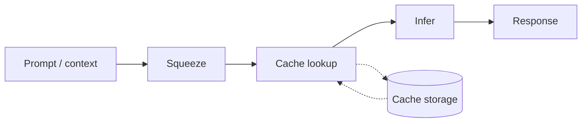

# Cheese Crab


Unified **edge AI inference engine**: run local LLMs on low-resource devices with minimal RAM. Think of it as local AI as lightweight as a crab—optimized for edge, laptops, and machines where you want to run 8B–13B models in about 4GB RAM.

Cheese Crab is built on [cheese.cpp](https://github.com/AutoCookies/cheesebrain) and adds mandatory context compression, prompt caching, optional RAG, and vision-token reduction so that inference stays fast and memory use stays low. Let the crab nibble your prompt.

---

## 5-Minute Quickstart

Get from zero to chat in three steps.

1. **Build**  
   ```bash
   mkdir build && cd build
   cmake .. -DCMAKE_BUILD_TYPE=Release
   cmake --build . -j
   ```
   Binaries land in `build/bin/`.

2. **Run a demo**  
   No model yet? The crab can fetch one and serve the minimal Web UI:
   ```bash
   ./build/bin/cheese-server --quickstart --webui --port 8080
   ```
   Or pull a specific model and start the server:
   ```bash
   ./build/bin/cheese-server --pull hf://user/repo:Q4_K_M --webui --port 8080
   ```

3. **Chat**  
   Open http://localhost:8080 in your browser. Use the crab-themed UI: type in “Nibble prompt here…”, send, and watch the stream. Or call the API:
   ```bash
   curl http://localhost:8080/v1/chat/completions -H "Content-Type: application/json" \
     -d '{"model":"","messages":[{"role":"user","content":"Hello!"}],"stream":true}'
   ```

For **Crab Mode** (aggressive squeeze, 10 min cache): add `--extreme`. For **Ultra Crab Mode** (ultra light, Q2_K cache): add `--low-ram`.

---

## Crab Pipeline

High-level flow: squeeze context, cache prefixes, infer, optionally store.



Squeezing context is like melting cheese so the crab can snack faster; caching prefixes means the crab reuses work across turns.

---

## Main purposes

- **Edge and low-resource inference**  
  Run quantized LLMs (e.g. Q4_0, Q5_0) on CPU or GPU with small RAM footprint. Defaults (Q4_0 KV cache, context squeeze, vision squeeze) are tuned for ~4GB usage.

- **Context and vision squeeze**  
  - **Text:** Long prompts are compressed before tokenization (context squeezer) so the model sees fewer tokens.  
  - **Vision / video:** After the vision encoder, embeddings are reduced (merge or subsample) so the LLM gets fewer image/video tokens.  
  Both are built in and always enabled in the server/CLI path.

- **Prompt prefix caching**  
  Repeated prompt prefixes are cached (pomaicache) to avoid recomputing the same KV cache across turns or users.

- **Optional RAG (PomaiDB)**  
  When configured, the server can augment prompts with retrieved chunks from a local vector DB for retrieval-augmented generation.

- **Single stack: CLI + HTTP server**  
  Use the same binary for interactive chat (`cheese-cli`) or an OpenAI-compatible API (`cheese-server`).

---

## Build

Requirements: CMake 3.14+, C++17, and (optional) a GPU backend.

```bash
mkdir build && cd build
cmake .. -DCMAKE_BUILD_TYPE=Release
cmake --build . -j
```

Binaries are produced under `build/bin/`, including:

- `cheese-cli` — interactive chat CLI  
- `cheese-server` — HTTP API server  
- `cheese-quantize` — quantize GGUF models  
- `cheese-mtmd-cli` — multimodal (image/audio) CLI  

---

## Usage examples

### 1. Interactive chat (CLI)

Run with a local GGUF model:

```bash
./build/bin/cheese-cli -m models/qwen0.5b.gguf
```

One-off completion with a prompt and token limit:

```bash
./build/bin/cheese-cli -m models/qwen0.5b.gguf -p "Hello, how are you?" -n 64
```

Start without a model and load or pull one from the prompt:

```bash
./build/bin/cheese-cli
# Then: /model load models/qwen0.5b.gguf
# Or:  /model pull user/repo:Q4_K_M
```

Use more context or GPU layers if you have the RAM/VRAM:

```bash
./build/bin/cheese-cli -m models/qwen0.5b.gguf -c 2048 -ngl 99
```

**CPU-only (no GPU):** The default KV cache type is Q4_0, which requires Flash Attention. On builds without GPU support you must use non-quantized cache: add `-ctk f16 -ctv f16` (or `-ctk f32 -ctv f32`). Otherwise you may see "V cache quantization requires flash_attn" and a crash.

### 2. HTTP server (OpenAI-compatible API)

Serve a single model:

```bash
./build/bin/cheese-server -m models/qwen0.5b.gguf --host 0.0.0.0 --port 8080
```

With optional web UI:

```bash
./build/bin/cheese-server -m models/qwen0.5b.gguf --port 8080 --webui
```

Chat completions are then available at `http://localhost:8080/v1/chat/completions` (and other OpenAI-style routes).

**Using multiple GGUF files from `models/`:** To use all `.gguf` files in a directory (e.g. `models/`) and switch between them without restarting, run the server in **router (multi-model) mode**: omit `-m` and set `--models-dir`:

```bash
./build/bin/cheese-server --models-dir models --webui --port 8080
```

The server discovers models from `models/` and lists them in `/v1/models`. Load or switch models via the API (`POST /models/load` with `{"model": "modelname"}`) or the crab UI model selector. For a single-model setup, start with `-m path/to/model.gguf`; only one model is loaded and `/v1/models` returns that model.

### 3. Context and vision squeeze (defaults)

- **Text:** Context squeeze is enabled by default (aggressiveness 4, min length 8192 chars so short chats are not squeezed). Tune with:
  - `CHEESE_SQUEEZE_AGGRESSIVENESS` (0–10)  
  - Server/params: `contextsqueeze_aggressiveness`, `contextsqueeze_min_chars`

- **Vision:** Vision token squeeze runs after the encoder (default aggressiveness 1). Tune with:
  - `CHEESE_VISION_SQUEEZE_AGGRESSIVENESS` (0–9)  
  - Server/params: `vision_squeeze_aggressiveness`

### 4. Chat templates and `models/templates`

The server uses the model’s built-in chat template by default. To override or when the GGUF has no template, use `--chat-template-file` with a Jinja file from `models/templates/`:

```bash
./build/bin/cheese-server -m models/qwen0.5b.gguf --chat-template-file models/templates/Qwen-Qwen3-0.6B.jinja --webui --port 8080
```

See [models/templates/README.md](models/templates/README.md) for a **model → template mapping** (e.g. Qwen 0.5B/0.6B → `Qwen-Qwen3-0.6B.jinja`) so templates in that directory are used and not wasted.

### 5. RAG (PomaiDB)

When building with PomaiDB, set a RAG DB path and embedding dimension so the server can augment prompts with retrieved chunks:

- Server params: `rag_db_path`, `rag_dim`, `rag_topk`, `rag_token_budget`, `rag_membrane`  
- Only used when `rag_db_path` is non-empty.

### 6. Multimodal (image / audio)

Use the multimodal CLI with a vision-capable model and projector:

```bash
./build/bin/cheese-mtmd-cli -m /path/to/model.gguf --mmproj /path/to/mmproj.gguf --image image.png
```

Vision token squeeze applies automatically when the server or pipeline uses the mtmd path with a positive `vision_squeeze_aggressiveness`. With `-hf user/repo`, the crab can auto-fetch the mmproj from Hugging Face when it’s missing.

### 7. Running on low-resource devices (e.g. 16GB laptop)

To run heavier models (e.g. 8B) on limited RAM:

- **Prefer a smaller quantization.** Use **Q4_K_M** or **Q3_K_M** instead of Q8_0 so the model uses ~4–5 GB instead of ~8 GB. Download a pre-quantized file from Hugging Face when available.

- **Example: pull and run 8B Q4_K_M** (CPU-only, 16GB-friendly):
  ```bash
  ./build/bin/cheese-cli -hf Qwen/Qwen3-8B-GGUF -hff Qwen3-8B-Q4_K_M.gguf --jinja --color auto -fa off -ngl 0 -ctk f16 -ctv f16 -c 8192 --temp 0.6 --top-p 0.95 -n 2048
  ```
  With Crab Mode for more memory savings:
  ```bash
  ./build/bin/cheese-cli -hf Qwen/Qwen3-8B-GGUF -hff Qwen3-8B-Q4_K_M.gguf --jinja --color auto -fa off -ngl 0 -ctk f16 -ctv f16 -c 8192 --extreme -n 2048 --temp 0.6 --top-p 0.95
  ```

- **Local quantization:** To build your own Q4_K_M or Q3_K_M from an F16 GGUF (or requantize from Q8_0), use [tools/quantize/README.md](tools/quantize/README.md). For requantizing an existing quant (e.g. Q8_0 → Q4_K_M), add `--allow-requantize` to `cheese-quantize` (quality may drop slightly).

- **Runtime tips:** Use a smaller context (`-c 8192` or `-c 4096`), add `--extreme` for Crab Mode (aggressive context squeeze), and on **CPU-only** builds always add `-ctk f16 -ctv f16` so the KV cache does not require Flash Attention.

---

## Docker

A minimal image (target &lt;200 MB) can be built with Alpine:

```dockerfile
FROM alpine:3.19 AS builder
RUN apk add --no-cache build-base cmake git
WORKDIR /src
COPY . .
RUN mkdir build && cd build && cmake .. -DCMAKE_BUILD_TYPE=Release && cmake --build . -j

FROM alpine:3.19
RUN apk add --no-cache libstdc++
COPY --from=builder /src/build/bin/cheese-server /usr/local/bin/
COPY --from=builder /src/build/bin/cheese-cli /usr/local/bin/
EXPOSE 8080
ENTRYPOINT ["cheese-server"]
```

Build and run with quickstart or pull:

```bash
docker build -t cheesecrab .
docker run -p 8080:8080 cheesecrab --quickstart --webui --port 8080
# or pull a model first:
docker run -p 8080:8080 cheesecrab --pull hf://user/repo:Q4_K_M --webui --port 8080
```

---

## Nix

With [Nix](https://nixos.org/) (and [Flakes](https://nixos.wiki/wiki/Flakes)) you can build and run Cheese Crab without installing CMake or compilers:

```bash
nix build .#default
./result/bin/cheese-server --quickstart --webui --port 8080
```

Or run the CLI directly:

```bash
nix run .#default -- -m /path/to/model.gguf -p "Let the crab nibble!"
```

---

## Details

| Area            | Detail |
|-----------------|--------|
| **KV cache**    | Default type is Q4_0 (not F16) to save RAM. Override with `-ctk` / `-ctv` or env `CHEESE_ARG_CACHE_TYPE_K` / `CHEESE_ARG_CACHE_TYPE_V`. |
| **Models**      | Place GGUF files in `models/` (or any path). Use `-m path/to/model.gguf` or `/model load path`. |
| **Quantization**| Use `cheese-quantize` to produce Q4_0/Q5_0 etc. Quantized models are recommended for edge. |
| **Tests / benches** | From `build/`: `ctest -j4` runs tests; vendor benches: `./bin/bench-contextsqueezer`, `./bin/bench-pomaicache`, `./bin/bench-pomaidb-rag`. |

---

## Project layout (short)

- `src/` — Core library (cheese, KV cache, model loading).  
- `common/` — Shared CLI/server params, parsing, download.  
- `tools/cli/` — `cheese-cli`.  
- `tools/server/` — `cheese-server` and server logic.  
- `tools/mtmd/` — Multimodal (vision/audio) encode/decode.  
- `vendor/` — Vendored libs: contextsqueezer, pomaicache, pomaidb, etc.  

For more on the CLI and server (all flags, env vars), see:

- [tools/cli/README.md](tools/cli/README.md)  
- [tools/server/README.md](tools/server/README.md)
