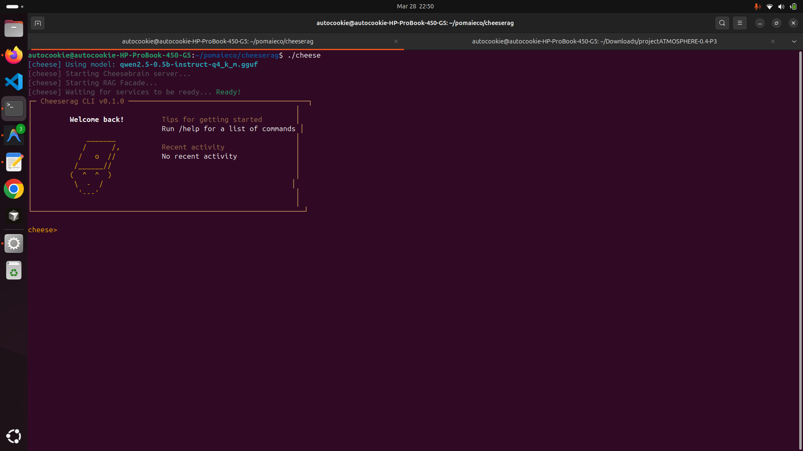

<div align="center">
  
  <h1>Cheeserag Studio</h1>
  <p><b>Privacy-First Local Knowledge Workspace — A Local-First Alternative to NotebookLM</b></p>

  [](https://opensource.org/licenses/MIT)
  [](https://golang.org/)
  [](https://en.cppreference.com/w/cpp/20)
  [](https://fastapi.tiangolo.com/)
  [](https://nextjs.org/)
</div>

---

**Cheeserag Studio** is an end-to-end, fully offline AI workspace. Upload PDFs, CSVs, and meeting transcripts, then chat with them through a rich 3-panel web interface. Every answer is strictly grounded in your documents — no hallucinations, no data leakage, zero cloud calls.

<div align="center">
  
</div>

## What's Inside

| Layer | Component | Language | Role |
|-------|-----------|----------|------|
| **LLM inference** | [Cheesebrain](https://github.com/pomagrenate/cheesebrain) (`third_party/cheesebrain`) | C++20 | OpenAI-compatible server (`/v1/chat/completions`, `/v1/embeddings`) |
| **Vector database** | [PomaiDB](https://github.com/pomagrenate/pomaidb) (`third_party/pomaidb`) | C++20 + Python | Multi-membrane edge vector DB; zero-OOM guarantee |
| **API orchestrator** | `cheese_api/` | Python / FastAPI | Workspace CRUD, async ingest, citation metadata, closed-book chat, audio overviews |
| **Autonomous agent** | `cmd/cheeserag-agent/` (uses [Cheesepath](https://github.com/AutoCookies/crabpath)) | Go | CLI agent with ReAct, planning, multi-role panel, tool registry |
| **Web UI** | `studio/` | TypeScript / Next.js 14 | 3-panel workspace: sources, chat, notes |

---

## Prerequisites

Install these once on your host machine before anything else.

### System packages

**Ubuntu / Debian:**
```bash
sudo apt-get update
sudo apt-get install -y \
    build-essential cmake ninja-build git \
    g++-13 pkg-config libssl-dev \
    python3 python3-venv python3-pip \
    golang-go \
    nodejs npm \
    tesseract-ocr          # OCR fallback for scanned PDFs
```

**macOS (Homebrew):**
```bash
brew install cmake ninja git openssl python go node tesseract
```

**Windows:** Use WSL2 (Ubuntu 24.04) and follow the Ubuntu steps above.

### Minimum versions

| Tool | Minimum | Check |
|------|---------|-------|
| CMake | 3.20 | `cmake --version` |
| g++ / clang++ | C++20 capable (GCC 11+, Clang 14+) | `g++ --version` |
| Go | 1.23 | `go version` |
| Python | 3.10 | `python3 --version` |
| Node.js | 18 | `node --version` |
| npm | 9 | `npm --version` |

---

## 1 — Clone & Initialise Submodules

```bash
git clone https://github.com/pomagrenate/cheeserag.git
cd cheeserag

# Pull all three submodules (Cheesebrain, PomaiDB, Cheesepath)
git submodule update --init --recursive
```

This populates:
- `third_party/cheesebrain/` — C++ LLM inference engine
- `third_party/pomaidb/` — C++ vector database (+ its own `third_party/palloc` sub-submodule)
- `third_party/cheesepath/` — Go agent framework

---

## 2 — Build the C++ Submodules

### 2a. Build PomaiDB

PomaiDB must be compiled first because its shared library (`libpomai_c.so`) is loaded by the Python API at runtime.

```bash
cd third_party/pomaidb

# PomaiDB has its own sub-submodule (palloc allocator)
git submodule update --init third_party/palloc

# Release build — produces libpomai_c.so + pomaidb_server
cmake -S . -B build \
    -DCMAKE_BUILD_TYPE=Release \
    -DCMAKE_CXX_COMPILER=g++ \
    -DPOMAI_BUILD_TESTS=OFF
cmake --build build -j$(nproc)

# Confirm the shared library was built
ls build/libpomai_c.so   # Linux
# ls build/libpomai_c.dylib  # macOS

cd ../..
```

**Optional: edge-optimised build (smaller binary, lower RAM footprint):**
```bash
cmake -S . -B build \
    -DCMAKE_BUILD_TYPE=Release \
    -DPOMAI_EDGE_BUILD=ON \
    -DPOMAI_BUILD_TESTS=OFF
cmake --build build -j$(nproc)
```

### 2b. Build Cheesebrain

Cheesebrain is the LLM inference server. The release build produces `cheese-server` and `cheese-cli`.

```bash
cd third_party/cheesebrain

cmake -B build -DCMAKE_BUILD_TYPE=Release
cmake --build build --config Release -j$(nproc)

# Verify
./build/bin/cheese-server --version

cd ../..
```

**GPU acceleration (optional):**
```bash
# CUDA
cmake -B build -DCMAKE_BUILD_TYPE=Release -DGGML_CUDA=ON
# Metal (Apple Silicon)
cmake -B build -DCMAKE_BUILD_TYPE=Release -DGGML_METAL=ON

cmake --build build --config Release -j$(nproc)
```

> After building, download a GGUF model into `models/`. A good default is
> [`qwen2.5-0.5b-instruct-q4_k_m.gguf`](https://huggingface.co/Qwen/Qwen2.5-0.5B-Instruct-GGUF)
> (~400 MB, runs on 1 GB RAM).

---

## 3 — Build the Go Agent (Cheesepath)

The Go agent links Cheesepath from the local submodule via a `replace` directive in `go.mod` — no separate build step is needed for the library itself.

```bash
# From the repo root
go build -o build/cheeserag-agent ./cmd/cheeserag-agent/

# Run once to verify
./build/cheeserag-agent --help
```

If you also want the standalone ingestion CLI:
```bash
go build -o build/cheeserag-ingest ./cmd/cheeserag-ingest/
```

---

## 4 — Set Up the Python API

```bash
# From the repo root — create an isolated virtualenv
python3 -m venv .venv
source .venv/bin/activate          # Windows: .venv\Scripts\activate

pip install --upgrade pip
pip install -r requirements.txt

# Export the path to the compiled PomaiDB C library
export POMAI_C_LIB=$(pwd)/third_party/pomaidb/build/libpomai_c.so
# macOS: export POMAI_C_LIB=$(pwd)/third_party/pomaidb/build/libpomai_c.dylib

# PomaiDB Python module path
export PYTHONPATH=$(pwd)/third_party/pomaidb/python:$PYTHONPATH
```

---

## 5 — Set Up the Next.js Studio

```bash
cd studio
npm install
cd ..
```

---

## Running Everything (Manual)

Open four terminal tabs from the repo root.

### Tab 1 — Cheesebrain (LLM + embeddings)
```bash
./third_party/cheesebrain/build/bin/cheese-server \
    --embeddings \
    --pooling mean \
    -m models/qwen2.5-0.5b-instruct-q4_k_m.gguf \
    --host 0.0.0.0 \
    --port 8080
```

### Tab 2 — Cheese API (FastAPI orchestrator)
```bash
source .venv/bin/activate

export POMAI_C_LIB=$(pwd)/third_party/pomaidb/build/libpomai_c.so
export PYTHONPATH=$(pwd)/third_party/pomaidb/python:$PYTHONPATH
export CHEESEBRAIN_URL=http://127.0.0.1:8080
export RAG_DB_PATH=$(pwd)/rag_db

uvicorn cheese_api.server:app --host 0.0.0.0 --port 9090 --reload
```

### Tab 3 — Studio (Next.js web UI)
```bash
cd studio
NEXT_PUBLIC_API_URL=http://localhost:9090 npm run dev
```

Open **http://localhost:3000** in your browser.

### Tab 4 — CLI Agent (optional)
```bash
export CHEESEBRAIN_URL=http://127.0.0.1:8080
export RAG_FACADE_URL=http://127.0.0.1:9090

./build/cheeserag-agent
```

---

## Running with Docker Compose (Recommended)

This is the easiest path. Docker builds all three C++ submodules automatically inside containers.

### Prerequisites
- Docker 24+
- Docker Compose v2

### Start
```bash
# Build images + start all services (Cheesebrain, Cheese API, Studio)
docker-compose up --build

# Or in the background
docker-compose up --build -d
```

Service URLs once running:

| Service | URL | Description |
|---------|-----|-------------|
| **Studio** | http://localhost:3000 | Web workspace UI |
| **Cheese API** | http://localhost:9090 | FastAPI + Swagger at `/docs` |
| **Cheesebrain** | http://localhost:8080 | LLM inference (internal) |

### Stopping
```bash
docker-compose down          # stop + remove containers
docker-compose down -v       # also remove persisted DB volume
```

### Enabling the legacy Streamlit UI
```bash
docker-compose --profile legacy up --build
# Available at http://localhost:8501
```

---

## Environment Variables

Set these in your shell, a `.env` file, or `docker-compose.yml`:

| Variable | Default | Description |
|----------|---------|-------------|
| `CHEESEBRAIN_URL` | `http://127.0.0.1:8080` | Cheesebrain server URL |
| `RAG_DB_PATH` | *(required)* | Directory where PomaiDB stores its files |
| `POMAI_C_LIB` | *(auto-detected)* | Path to `libpomai_c.so` / `.dylib` |
| `PYTHONPATH` | *(set manually)* | Must include `third_party/pomaidb/python` |
| `CHEESE_API_KEY` | `cheese-admin-key` | API key for all `X-API-Key` requests |
| `CHEESE_EMBEDDING_MODEL` | *(empty — auto)* | Model name to pass to `/v1/embeddings` |
| `CHEESE_CHAT_MODEL` | *(empty — auto)* | Model name to pass to `/v1/chat/completions` |
| `CHEESE_CLOSED_BOOK_THRESHOLD` | `0.35` | Similarity below which "not found" is returned |
| `RAG_MEMBRANE` | `rag` | Legacy default membrane name |
| `RAG_SHARDS` | `1` | Number of PomaiDB DB shards |
| `RAG_EF_SEARCH` | `128` | HNSW search `ef` parameter |
| `NEXT_PUBLIC_API_URL` | `http://localhost:9090` | API base URL used by the Studio frontend |
| `NEXT_PUBLIC_API_KEY` | `cheese-admin-key` | API key used by the Studio frontend |

---

## Using the Studio

1. **Open** http://localhost:3000
2. **Create a Workspace** — give it a name (e.g. "Thesis", "Meeting Notes")
3. **Upload documents** — drag & drop PDFs, CSVs, or text files onto the Sources panel. A progress bar tracks each file's ingestion chunk by chunk.
4. **Chat** — type a question. Answers are strictly grounded: if the answer is not in your documents, you'll see a yellow "cannot find" badge instead of a hallucination.
5. **Click a citation** — answers include `[1]`, `[2]` footnote markers. Clicking one opens the PDF at the exact cited page.
6. **Pin to notes** — click "Pin to notes" under any AI reply to send it to the right-hand scratchpad. Write your own analysis there and export as `.md`.

---

## Using the CLI Agent

```bash
./build/cheeserag-agent [flags]
```

Key flags:

| Flag | Default | Description |
|------|---------|-------------|
| `--strategy` | `react` | Agent strategy: `react`, `reflect`, `planexec`, `architect`, `fnagent`, `panel` |
| `--memory` | `buffer` | Memory type: `buffer`, `vector`, `summary`, `sliding` |
| `--max-history` | `40` | Max LLM history messages (sliding window) |
| `--max-obs-bytes` | `16384` | Max bytes per tool observation stored in history |
| `--panel-synth` | `llm` | Panel synthesis mode: `concat`, `llm`, `first`, `vote` |
| `--auto-approve` | `false` | Skip confirmation for dangerous tools |

### Slash commands inside the agent

| Command | Description |
|---------|-------------|
| `/ingest <file>` | Ingest a file into the RAG database |
| `/pin <file>` | Pin a file's content into session context (8 KB cap) |
| `/unpin <file>` | Remove a pinned file |
| `/strategy <name>` | Switch agent strategy mid-session |
| `/panel <goal>` | Run a multi-role panel (researcher + critic + planner) |
| `/memory` | Show current memory state |
| `/history` | Show conversation turns |
| `/clear` | Clear conversation history |
| `/help` | List all commands |

---

## API Reference

The FastAPI server runs at `:9090`. Full interactive docs at **http://localhost:9090/docs**.

### Workspaces

```
POST   /v1/workspaces              Create workspace
GET    /v1/workspaces              List all workspaces
DELETE /v1/workspaces/{id}         Delete workspace
GET    /v1/workspaces/{id}/docs    List documents in workspace
```

### Ingestion (async)

```
POST /v1/ingest
  Form fields: file (multipart), doc_id (int), workspace_id (str), max_chunk_bytes, overlap_bytes
  → { job_id, doc_id }

GET  /v1/jobs/{job_id}/stream      SSE stream: { status, progress, total }
GET  /v1/jobs/{job_id}             Poll job status
```

### Retrieval & Chat

```
POST /v1/retrieve
  Body: { query, top_k, workspace_id, min_score }
  → { context, hits: [{ text, score, citation: { file, page, byte_offset, line } }] }

POST /v1/chat
  Body: { workspace_id, message, history }
  → SSE stream: citations event, then token events, then [DONE]
```

### Audio Overview

```
POST /v1/audio_overview
  Body: { workspace_id, top_k }
  → { job_id }

GET  /v1/audio_overview/{job_id}/status
GET  /v1/audio_overview/{job_id}/download   → audio/wav
```

---

## Project Structure

```
cheeserag/
├── third_party/
│   ├── cheesebrain/        # C++ LLM inference engine (submodule)
│   ├── pomaidb/            # C++ vector database (submodule)
│   │   └── third_party/palloc/   # Memory allocator (sub-submodule)
│   └── cheesepath/         # Go agent framework (submodule)
│
├── cheese_api/             # Python FastAPI orchestrator
│   ├── server.py           # All API endpoints
│   ├── ingestion.py        # PDF/CSV/text chunking + OCR
│   ├── pomaidb_extra.py    # PomaiDB ctypes wrappers + KV metadata
│   ├── embeddings.py       # Cheesebrain embedding client
│   ├── audio_overview.py   # TTS dialogue generation
│   └── workspace_indexer.py # AST-based code indexing
│
├── cmd/
│   ├── cheeserag-agent/    # Go CLI agent (31 tools, 6 strategies)
│   └── cheeserag-ingest/   # Standalone ingestion CLI
│
├── studio/                 # Next.js 14 web workspace
│   ├── app/                # App Router pages
│   ├── components/         # SourcePanel, ChatPanel, NotesPanel, CitationModal
│   └── lib/                # API client, Zustand stores
│
├── models/                 # GGUF model files (not in git)
├── rag_db/                 # PomaiDB database files (not in git)
├── docker-compose.yml      # Production stack
├── Dockerfile              # cheese-api container
├── requirements.txt        # Python dependencies
└── go.mod                  # Go module
```

---

## Troubleshooting

### `libpomai_c.so: cannot open shared object file`
PomaiDB's shared library was not found. Set the path explicitly:
```bash
export POMAI_C_LIB=$(pwd)/third_party/pomaidb/build/libpomai_c.so
```
Or add it to `LD_LIBRARY_PATH`:
```bash
export LD_LIBRARY_PATH=$(pwd)/third_party/pomaidb/build:$LD_LIBRARY_PATH
```

### `git submodule update --init --recursive` fails on `palloc`
PomaiDB's sub-submodule (`third_party/palloc`) must be initialised from inside the PomaiDB directory:
```bash
cd third_party/pomaidb
git submodule update --init third_party/palloc
```

### CMake version too old (`cmake_minimum_required` error)
PomaiDB requires CMake 3.20+. Install from [cmake.org](https://cmake.org/download/) or via pip:
```bash
pip install cmake --upgrade
```

### `RAG_DB_PATH must be set` error from the API
Export the environment variable before starting the server:
```bash
export RAG_DB_PATH=$(pwd)/rag_db
mkdir -p rag_db
```

### Port already in use
```bash
# Check what is using port 8080 / 9090
lsof -i :8080
lsof -i :9090
# Kill the process or change the port in docker-compose.yml
```

### Studio shows `fetch failed` / blank page
Ensure the API is running and `NEXT_PUBLIC_API_URL` points to it:
```bash
curl http://localhost:9090/health
```

---

## Architecture: Data Flow

```
Browser
  │  drag-drop PDF
  ▼
Studio (Next.js :3000)
  │  POST /api/v1/ingest  (multipart)
  ▼
Cheese API (FastAPI :9090)
  │  1. process_file_with_meta() — chunk PDF pages with byte offsets
  │  2. fetch_embedding()        — POST /v1/embeddings → Cheesebrain
  │  3. put_chunk_with_text()    — write vector to ws_{id}_rag membrane
  │  4. store_chunk_meta()       — write {file,page,offset} to ws_{id}_meta KV
  │  SSE progress → browser
  ▼
PomaiDB (libpomai_c.so — in-process)

                              Chat query
Browser ──────────────────────────────────────►
                                                Cheese API
                                                  │  embed query
                                                  │  search_rag_membrane()
                                                  │  if max_score < 0.35 → "not found"
                                                  │  else: build grounded system prompt
                                                  │  stream /v1/chat/completions
                                                  ▼
                                               Cheesebrain (:8080)
```

---

## License

MIT — see [LICENSE](LICENSE).
