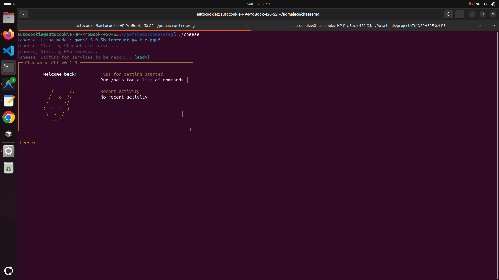

<div align="center">

# 🧀 Cheeserag Studio

### Privacy-First Local RAG Workspace for AI-Powered Document Research

**A fully offline, local-first alternative to NotebookLM — built for private knowledge, grounded AI answers, citations, and resource-constrained hardware.**

<p>
  
</p>

<p>
  <a href="https://github.com/pomagrenate/cheeserag/stargazers">
    
  </a>
  <a href="https://github.com/pomagrenate/cheeserag/blob/main/LICENSE">
    
  </a>
  
  
  
</p>

<p>
  
  
  
  
</p>

<p>
  <a href="#-why-cheeserag-studio">Why Cheeserag</a> ·
  <a href="#-features">Features</a> ·
  <a href="#-architecture">Architecture</a> ·
  <a href="#-quick-start">Quick Start</a> ·
  <a href="#-docker-compose-recommended">Docker</a> ·
  <a href="#-api-reference">API</a>
</p>

</div>

---

## What is Cheeserag Studio?

**Cheeserag Studio is a privacy-first, fully offline AI knowledge workspace that lets you chat with your own documents using local AI models.**

Upload PDFs, CSVs, text files, meeting transcripts, and other knowledge sources. Cheeserag Studio indexes them locally, retrieves relevant context with a custom vector database, and generates answers using a local GGUF model.

No OpenAI API.

No cloud RAG service.

No external document processing.

No mandatory internet connection.

Your documents stay on your machine.

```text
                 Your Documents
                       │
            ┌──────────┼──────────┐
            ▼          ▼          ▼
           PDF        CSV       Text
            │          │          │
            └──────────┼──────────┘
                       ▼
                 Local Ingestion
                       │
                       ▼
                Local Embeddings
                       │
                       ▼
                    PomaiDB
                       │
                  Vector Search
                       │
                       ▼
                Retrieved Context
                       │
                       ▼
                 Local LLM
                Cheesebrain
                       │
                       ▼
              Grounded Answer
                       │
                       ▼
                  Citation
```

The entire pipeline runs locally.

---

<div align="center">
  
</div>

---

# Why Cheeserag Studio?

Most AI document assistants depend on cloud APIs.

That creates problems when your data is:

* Private
* Sensitive
* Confidential
* Offline
* Air-gapped
* Too large to upload
* Subject to data residency requirements
* Stored on low-resource hardware

Cheeserag Studio takes a different approach:

> **Bring the AI to your documents instead of sending your documents to the AI.**

The result is a **local RAG system** designed around privacy, deterministic retrieval, small language models, and constrained hardware.

### Traditional Cloud RAG

```text
Documents
    │
    ▼
Cloud Storage
    │
    ▼
Cloud Embeddings
    │
    ▼
Cloud Vector DB
    │
    ▼
Cloud LLM
    │
    ▼
Answer
```

### Cheeserag Studio

```text
Documents
    │
    ▼
Local Ingestion
    │
    ▼
Local Embeddings
    │
    ▼
PomaiDB
    │
    ▼
Local Retrieval
    │
    ▼
Cheesebrain
    │
    ▼
Grounded Answer
```

**Your data never needs to leave the machine.**

---

# ✨ Features

## 🔒 Fully Offline & Privacy-First

Cheeserag Studio is designed for **local-first AI and air-gapped environments**.

All major components can run locally:

* LLM inference
* Embedding generation
* Vector storage
* Document ingestion
* Retrieval
* Citation generation
* Chat
* Audio overview generation

There is no requirement to send your documents to OpenAI, Anthropic, Google, or another cloud provider.

---

## 📚 Local RAG for Your Documents

Cheeserag Studio implements a complete **Retrieval-Augmented Generation (RAG)** pipeline.

```text
Document
   ↓
Chunk
   ↓
Embed
   ↓
Store
   ↓
Retrieve
   ↓
Ground
   ↓
Generate
```

Supported knowledge sources include:

* PDF documents
* CSV files
* Text files
* Meeting transcripts
* Source code
* Structured workspace content

The retrieval layer uses **PomaiDB**, a custom C++ vector database designed for embedded and edge AI workloads.

---

## 🎯 Grounded Answers with Programmatic Citations

Cheeserag Studio does not ask the LLM to invent citation markers.

Instead, citations are generated by the backend.

```text
Retrieved Chunks
      │
      ▼
Local LLM
      │
      ▼
Short Extractive Answer
      │
      ▼
TF-IDF Similarity
      │
      ▼
Citation Engine
      │
      ▼
[1] [2] [3]
```

The LLM produces the answer.

The backend determines which source supports it.

This separation makes citations significantly more reliable with small local models.

---

## 🚫 Closed-Book Retrieval

If the retrieved documents do not contain enough evidence, Cheeserag Studio can explicitly return:

```text
Cannot find
```

instead of forcing the model to answer.

The default closed-book threshold is:

```text
CHEESE_CLOSED_BOOK_THRESHOLD=0.35
```

This provides an important safety boundary:

```text
Weak retrieval
     ↓
No answer
```

instead of:

```text
Weak retrieval
     ↓
Guess
     ↓
Hallucination
```

---

## 🧠 Designed for Small Local LLMs

Cheeserag Studio is not built around the assumption that you need a huge model.

The architecture is specifically designed to make **small language models useful through better retrieval and orchestration**.

The default setup uses:

```text
Qwen2.5-0.5B-Instruct
        +
Cheesebrain
        +
PomaiDB
        +
Constrained RAG
        +
Citation Engine
```

A small model has obvious limitations:

* Long-context hallucination
* Poor formatting consistency
* Weak instruction following
* Difficulty maintaining citation markers
* Reasoning degradation with excessive context

Instead of simply increasing model size, Cheeserag Studio reduces the amount of reasoning the model must perform.

> **Better pipeline engineering can compensate for a surprisingly large amount of model limitation.**

---

# 🤖 AI Agent

Cheeserag Studio also includes a Go-based autonomous CLI agent.

The agent supports:

* ReAct
* Reflection
* Plan/Execute
* Architect
* Function Agent
* Multi-role Panel

It can interact with the RAG workspace through tools and persistent memory strategies.

```text
                  User
                   │
                   ▼
             Cheeserap Agent
                   │
          ┌────────┼────────┐
          ▼        ▼        ▼
        Tools    Memory    RAG
          │        │        │
          └────────┼────────┘
                   ▼
              Cheesebrain
```

---

# 🎙️ Audio Overviews

Cheeserag Studio can transform retrieved knowledge into conversational audio summaries.

Instead of asking a small model to generate an entire podcast in one massive prompt, the pipeline breaks the task into controlled stages:

```text
Documents
    │
    ▼
Extract key points
    │
    ▼
Deduplicate + rank
    │
    ▼
Generate dialogue
    │
    ▼
Host A ↔ Host B
    │
    ▼
Audio
```

Each stage uses a constrained amount of context.

This makes audio generation much more reliable for small local models.

---

# 📝 Personal Knowledge Workspace

Cheeserag Studio provides a three-panel interface:

```text
┌────────────────┬──────────────────────┬─────────────────┐
│                │                      │                 │
│    Sources     │        Chat          │      Notes      │
│                │                      │                 │
│   Documents    │   AI Conversation    │   Scratchpad    │
│                │                      │                 │
│   PDF / CSV    │   Grounded Answers   │   Saved Ideas   │
│                │                      │                 │
└────────────────┴──────────────────────┴─────────────────┘
```

The workflow is simple:

1. Create a workspace
2. Upload documents
3. Wait for local indexing
4. Ask questions
5. Inspect citations
6. Pin useful answers to notes
7. Export your research

---

# 🔍 Source-Level Citations

Every grounded answer can contain citations pointing back to the original source.

Citation metadata includes:

```text
file
page
byte_offset
line
```

Clicking a citation takes you back to the exact location in the source document.

This turns Cheeserag Studio from a generic chatbot into a **document research workspace**.

---

# ⚡ Async Document Ingestion

Large documents are processed asynchronously.

```text
Upload
  │
  ▼
Create Job
  │
  ▼
Chunk
  │
  ▼
Embed
  │
  ▼
Index
  │
  ▼
Complete
```

Progress can be streamed through Server-Sent Events:

```text
POST /v1/ingest
       │
       ▼
    job_id
       │
       ▼
GET /v1/jobs/{job_id}/stream
       │
       ▼
status + progress + total
```

---

# 🧩 Architecture

Cheeserag Studio is built as a local AI stack composed of several specialized components.

| Layer               | Component       | Technology       | Responsibility                                  |
| ------------------- | --------------- | ---------------- | ----------------------------------------------- |
| **LLM inference**   | Cheesebrain     | C++20            | Local chat + embedding inference                |
| **Vector database** | PomaiDB         | C++20            | Embedded vector and multimodal storage          |
| **API**             | Cheese API      | Python / FastAPI | RAG orchestration, ingestion, citations         |
| **AI Agent**        | Cheeserap Agent | Go               | Tools, planning, memory, multi-agent strategies |
| **Web UI**          | Studio          | Next.js 14       | Sources, chat, notes                            |
| **Storage**         | PomaiDB         | C++              | Local persistent knowledge store                |


---

# 🏗️ Data Flow

```text
                         Browser
                            │
                    Drag & Drop PDF
                            │
                            ▼
                  ┌──────────────────┐
                  │   Studio :3000   │
                  │    Next.js 14    │
                  └────────┬─────────┘
                           │
                    POST /api/v1/ingest
                           │
                           ▼
                  ┌──────────────────┐
                  │   Cheese API     │
                  │   FastAPI :9090  │
                  └────────┬─────────┘
                           │
              ┌────────────┼────────────┐
              │            │            │
              ▼            ▼            ▼
           Chunking     Embedding    Metadata
              │            │            │
              │            ▼            │
              │      Cheesebrain        │
              │         :8080           │
              │            │            │
              └────────────┼────────────┘
                           ▼
                  ┌──────────────────┐
                  │     PomaiDB      │
                  │   In-process DB  │
                  └────────┬─────────┘
                           │
                           │
                       User Query
                           │
                           ▼
                     Embed Query
                           │
                           ▼
                    Vector Retrieval
                           │
                           ▼
                  Closed-Book Check
                           │
                    ┌──────┴──────┐
                    │             │
                  Found         Not Found
                    │             │
                    ▼             ▼
             Grounded Prompt   "Cannot find"
                    │
                    ▼
                Cheesebrain
                    │
                    ▼
             Citation Engine
                    │
                    ▼
               Final Answer
```

---

# 🧠 Why Small Models Work Here

Cheeserag Studio follows a simple principle:

> **Do not make the LLM solve problems that deterministic software can solve better.**

Instead of asking the model to:

* Find relevant documents
* Track citation IDs
* Determine source locations
* Deduplicate information
* Manage large contexts
* Generate complex multi-step summaries

the backend handles as much deterministic work as possible.

The LLM focuses on the part it is actually good at:

```text
Understand retrieved context
        +
Generate concise answer
```

---

# 🔬 Engineering Tactics

## 1. Algorithmic Citation

The model receives a short extractive prompt:

```text
Context: <chunk text>
Question: <user question>
Answer (one short sentence, use exact words from the context above):
```

The backend then calculates TF-IDF cosine similarity between the generated answer and retrieved chunks.

Citation markers are inserted programmatically.

The model never controls the citation IDs.


---

## 2. Prompt Chaining

Audio generation is split into small operations:

| Stage     | Task                         | Max Tokens |
| --------- | ---------------------------- | ---------: |
| Extract   | Summarize each chunk         |         80 |
| Aggregate | Deduplicate + rank           |          — |
| Dialogue  | Generate Host A / B exchange |   120 + 80 |

This keeps each generation task inside a range that a small model can handle reliably.


---

## 3. Constrained Generation

Local LLM calls use conservative generation settings:

```text
max_tokens       = 150
temperature      = 0.2–0.3
repeat_penalty   = 1.1
```

Completion-style prompts are used to reduce unnecessary free-form generation.


---

# 🦣 Edge AI & Resource-Constrained Hardware

Cheeserag Studio is designed for environments where compute and memory are limited.

The architecture has been designed around:

* Local GGUF models
* Small embedding models
* Embedded vector storage
* Bounded retrieval
* Short generation contexts
* Local inference
* Minimal external dependencies

The project targets the practical scenario of running a **private RAG workspace on a normal laptop or Raspberry Pi**, rather than requiring a dedicated cloud AI infrastructure.


---

# 🔐 Security & Privacy Model

Cheeserag Studio follows a **local-first privacy model**.

Your documents are processed locally by:

```text
Local Files
   ↓
Local API
   ↓
Local Vector DB
   ↓
Local Embedding Model
   ↓
Local LLM
```

There is no inherent requirement for:

* Cloud document storage
* External vector databases
* OpenAI API
* Anthropic API
* Hosted RAG services

This makes the project suitable for:

* Private research
* Internal documentation
* Sensitive notes
* Confidential documents
* Offline environments
* Air-gapped workflows
* Local knowledge bases

---

# 🚀 Quick Start

## Prerequisites

Cheeserag Studio requires:

| Tool    | Minimum |
| ------- | ------: |
| CMake   |    3.20 |
| GCC     |     11+ |
| Clang   |     14+ |
| C++     |   C++20 |
| Go      |    1.23 |
| Python  |    3.10 |
| Node.js |      18 |
| npm     |       9 |

For scanned PDFs, install Tesseract OCR.

### Ubuntu / Debian

```bash
sudo apt-get update

sudo apt-get install -y \
    build-essential \
    cmake \
    ninja-build \
    git \
    g++-13 \
    pkg-config \
    libssl-dev \
    python3 \
    python3-venv \
    python3-pip \
    golang-go \
    nodejs \
    npm \
    tesseract-ocr
```

### macOS

```bash
brew install \
    cmake \
    ninja \
    git \
    openssl \
    python \
    go \
    node \
    tesseract
```

### Windows

Use **WSL2 with Ubuntu 24.04** and follow the Linux installation steps.


---

# 1. Clone the Repository

```bash
git clone https://github.com/pomagrenate/cheeserag.git
cd cheeserag

git submodule update --init --recursive
```

This initializes:

```text
third_party/
├── cheesebrain/
├── pomaidb/
│   └── third_party/palloc/
└── cheesepath/
```


---

# 2. Build PomaiDB

PomaiDB must be built first because the Python API loads its C shared library.

```bash
cd third_party/pomaidb

git submodule update --init third_party/palloc

cmake -S . -B build \
    -DCMAKE_BUILD_TYPE=Release \
    -DCMAKE_CXX_COMPILER=g++ \
    -DPOMAI_BUILD_TESTS=OFF

cmake --build build -j$(nproc)

ls build/libpomai_c.so

cd ../..
```

For an edge-optimized build:

```bash
cmake -S . -B build \
    -DCMAKE_BUILD_TYPE=Release \
    -DPOMAI_EDGE_BUILD=ON \
    -DPOMAI_BUILD_TESTS=OFF

cmake --build build -j$(nproc)
```


---

# 3. Build Cheesebrain

```bash
cd third_party/cheesebrain

cmake -B build \
    -DCMAKE_BUILD_TYPE=Release

cmake --build build \
    --config Release \
    -j$(nproc)

./build/bin/cheese-server --version

cd ../..
```

### Optional GPU Acceleration

#### NVIDIA CUDA

```bash
cmake -B build \
    -DCMAKE_BUILD_TYPE=Release \
    -DGGML_CUDA=ON
```

#### Apple Silicon Metal

```bash
cmake -B build \
    -DCMAKE_BUILD_TYPE=Release \
    -DGGML_METAL=ON
```

Then build:

```bash
cmake --build build \
    --config Release \
    -j$(nproc)
```


---

# 4. Download a Local GGUF Model

Place a GGUF model inside:

```text
models/
```

A lightweight default is:

**Qwen2.5-0.5B-Instruct-GGUF**

```text
~400 MB
```

This model is suitable for low-memory local inference.


---

# 5. Build the Go Agent

From the repository root:

```bash
go build \
    -o build/cheeserag-agent \
    ./cmd/cheeserag-agent/
```

Verify:

```bash
./build/cheeserag-agent --help
```

Optional ingestion CLI:

```bash
go build \
    -o build/cheeserag-ingest \
    ./cmd/cheeserag-ingest/
```


---

# 6. Install the Python API

```bash
python3 -m venv .venv

source .venv/bin/activate

pip install --upgrade pip
pip install -r requirements.txt
```

Set the PomaiDB library:

```bash
export POMAI_C_LIB=$(pwd)/third_party/pomaidb/build/libpomai_c.so
```

For macOS:

```bash
export POMAI_C_LIB=$(pwd)/third_party/pomaidb/build/libpomai_c.dylib
```

Add the PomaiDB Python module:

```bash
export PYTHONPATH=$(pwd)/third_party/pomaidb/python:$PYTHONPATH
```


---

# 7. Install the Web Studio

```bash
cd studio

npm install

cd ..
```


---

# ▶️ Run Everything Manually

Cheeserag Studio consists of three primary runtime services plus an optional CLI agent.

## Terminal 1 — Cheesebrain

```bash
./third_party/cheesebrain/build/bin/cheese-server \
    --embeddings \
    --pooling mean \
    -m models/qwen2.5-0.5b-instruct-q4_k_m.gguf \
    --host 0.0.0.0 \
    --port 8080
```

## Terminal 2 — Cheese API

```bash
source .venv/bin/activate

export POMAI_C_LIB=$(pwd)/third_party/pomaidb/build/libpomai_c.so
export PYTHONPATH=$(pwd)/third_party/pomaidb/python:$PYTHONPATH
export CHEESEBRAIN_URL=http://127.0.0.1:8080
export RAG_DB_PATH=$(pwd)/rag_db

uvicorn cheese_api.server:app \
    --host 0.0.0.0 \
    --port 9090 \
    --reload
```

## Terminal 3 — Studio

```bash
cd studio

NEXT_PUBLIC_API_URL=http://localhost:9090 \
npm run dev
```

Then open:

```text
http://localhost:3000
```

## Terminal 4 — CLI Agent

Optional:

```bash
export CHEESEBRAIN_URL=http://127.0.0.1:8080
export RAG_FACADE_URL=http://127.0.0.1:9090

./build/cheeserag-agent
```


---

# 🐳 Docker Compose

For the easiest setup, use Docker Compose.

## Requirements

* Docker 24+
* Docker Compose v2

## Start

```bash
docker-compose up --build
```

Or run in the background:

```bash
docker-compose up --build -d
```

Services:

| Service         | URL                     | Purpose             |
| --------------- | ----------------------- | ------------------- |
| **Studio**      | `http://localhost:3000` | Web workspace       |
| **Cheese API**  | `http://localhost:9090` | FastAPI + Swagger   |
| **Cheesebrain** | `http://localhost:8080` | Local LLM inference |


### Stop

```bash
docker-compose down
```

Remove persisted database volumes:

```bash
docker-compose down -v
```

### Legacy Streamlit UI

```bash
docker-compose --profile legacy up --build
```

Available at:

```text
http://localhost:8501
```

---

# ⚙️ Environment Variables

| Variable                       | Default                 | Description                  |
| ------------------------------ | ----------------------- | ---------------------------- |
| `CHEESEBRAIN_URL`              | `http://127.0.0.1:8080` | Cheesebrain inference server |
| `RAG_DB_PATH`                  | Required                | PomaiDB database directory   |
| `POMAI_C_LIB`                  | Auto-detected           | PomaiDB shared library       |
| `PYTHONPATH`                   | Manual                  | PomaiDB Python module path   |
| `CHEESE_API_KEY`               | `cheese-admin-key`      | API authentication key       |
| `CHEESE_EMBEDDING_MODEL`       | Auto                    | Embedding model              |
| `CHEESE_CHAT_MODEL`            | Auto                    | Chat model                   |
| `CHEESE_CLOSED_BOOK_THRESHOLD` | `0.35`                  | Minimum retrieval similarity |
| `RAG_MEMBRANE`                 | `rag`                   | Default RAG membrane         |
| `RAG_SHARDS`                   | `1`                     | PomaiDB shard count          |
| `RAG_EF_SEARCH`                | `128`                   | HNSW `ef` search parameter   |
| `NEXT_PUBLIC_API_URL`          | `http://localhost:9090` | Studio API URL               |
| `NEXT_PUBLIC_API_KEY`          | `cheese-admin-key`      | Studio API key               |


---

# 🖥️ Using Cheeserag Studio

Once the application is running:

### 1. Create a Workspace

Open:

```text
http://localhost:3000
```

Create a workspace such as:

```text
Thesis
Research
Meeting Notes
Project Documentation
Personal Knowledge
```

### 2. Upload Documents

Drag and drop:

* PDFs
* CSVs
* Text files
* Meeting transcripts

into the Sources panel.

### 3. Ask Questions

Ask questions about your documents.

Cheeserag retrieves relevant chunks and sends only the necessary context to the local model.

### 4. Inspect Citations

Click `[1]`, `[2]`, etc. to inspect the original source location.

### 5. Save Notes

Pin useful answers to the Notes panel and export your notes as Markdown.


---

# 🤖 Using the CLI Agent

Run:

```bash
./build/cheeserag-agent
```

## Agent Strategies

| Strategy    | Purpose                         |
| ----------- | ------------------------------- |
| `react`     | Reason + act                    |
| `reflect`   | Iterative self-review           |
| `planexec`  | Plan then execute               |
| `architect` | Architecture-oriented reasoning |
| `fnagent`   | Function/tool execution         |
| `panel`     | Multi-role agent panel          |

Example:

```bash
./build/cheeserag-agent \
    --strategy panel
```

## Memory Modes

```text
buffer
vector
summary
sliding
```

Example:

```bash
./build/cheeserag-agent \
    --memory vector
```

## Slash Commands

| Command            | Description                   |
| ------------------ | ----------------------------- |
| `/ingest <file>`   | Ingest a document             |
| `/pin <file>`      | Pin file content into context |
| `/unpin <file>`    | Remove pinned content         |
| `/strategy <name>` | Change agent strategy         |
| `/panel <goal>`    | Run a multi-role panel        |
| `/memory`          | Show memory state             |
| `/history`         | Show conversation history     |
| `/clear`           | Clear conversation            |
| `/help`            | Show commands                 |


---

# 🔌 API Reference

The FastAPI backend runs on:

```text
http://localhost:9090
```

Interactive Swagger documentation:

```text
http://localhost:9090/docs
```

---

## Workspaces

```http
POST   /v1/workspaces
GET    /v1/workspaces
DELETE /v1/workspaces/{id}
GET    /v1/workspaces/{id}/docs
```

---

## Document Ingestion

```http
POST /v1/ingest
```

Multipart fields:

```text
file
doc_id
workspace_id
max_chunk_bytes
overlap_bytes
```

Returns:

```json
{
  "job_id": "...",
  "doc_id": 1
}
```

Track progress:

```http
GET /v1/jobs/{job_id}/stream
GET /v1/jobs/{job_id}
```

The stream provides:

```text
status
progress
total
```

---

## Retrieval

```http
POST /v1/retrieve
```

Request:

```json
{
  "query": "What is this document about?",
  "top_k": 5,
  "workspace_id": "workspace-id",
  "min_score": 0.35
}
```

Response contains:

```json
{
  "context": "...",
  "hits": [
    {
      "text": "...",
      "score": 0.82,
      "citation": {
        "file": "document.pdf",
        "page": 3,
        "byte_offset": 1204,
        "line": 42
      }
    }
  ]
}
```

---

## Grounded Chat

```http
POST /v1/chat
```

Request:

```json
{
  "workspace_id": "workspace-id",
  "message": "Summarize the main findings.",
  "history": []
}
```

The response is streamed using Server-Sent Events.

The stream emits:

```text
citations
tokens
[DONE]
```

---

## Audio Overview

Create an audio overview:

```http
POST /v1/audio_overview
```

Request:

```json
{
  "workspace_id": "workspace-id",
  "top_k": 5
}
```

Returns:

```json
{
  "job_id": "..."
}
```

Check status:

```http
GET /v1/audio_overview/{job_id}/status
```

Download:

```http
GET /v1/audio_overview/{job_id}/download
```

Returns:

```text
audio/wav
```


---

# 📁 Project Structure

```text
cheeserag/
│
├── third_party/
│   ├── cheesebrain/          # C++ local LLM inference engine
│   ├── pomaidb/              # C++ embedded vector database
│   │   └── third_party/
│   │       └── palloc/       # Memory allocator
│   └── cheesepath/           # Go agent framework
│
├── cheese_api/
│   ├── server.py             # FastAPI application
│   ├── ingestion.py          # PDF/CSV/text ingestion + OCR
│   ├── pomaidb_extra.py      # PomaiDB integration
│   ├── embeddings.py         # Embedding client
│   ├── audio_overview.py     # Audio generation
│   └── workspace_indexer.py  # AST-based code indexing
│
├── cmd/
│   ├── cheeserag-agent/      # Autonomous Go agent
│   └── cheeserag-ingest/     # Standalone ingestion CLI
│
├── studio/
│   ├── app/                  # Next.js App Router
│   ├── components/           # Workspace UI
│   └── lib/                  # API + state management
│
├── models/                   # Local GGUF models
├── rag_db/                   # Local PomaiDB data
├── docker-compose.yml
├── Dockerfile
├── requirements.txt
└── go.mod
```


---

# 🛠️ Troubleshooting

## `libpomai_c.so: cannot open shared object file`

Set the library path:

```bash
export POMAI_C_LIB=$(pwd)/third_party/pomaidb/build/libpomai_c.so
```

Or:

```bash
export LD_LIBRARY_PATH=$(pwd)/third_party/pomaidb/build:$LD_LIBRARY_PATH
```

---

## `git submodule update --init --recursive` fails on `palloc`

Initialize the PomaiDB submodule manually:

```bash
cd third_party/pomaidb

git submodule update --init third_party/palloc
```

---

## CMake is too old

Cheeserag Studio requires CMake 3.20+.

Upgrade:

```bash
pip install cmake --upgrade
```

---

## `RAG_DB_PATH must be set`

Set:

```bash
export RAG_DB_PATH=$(pwd)/rag_db

mkdir -p rag_db
```

---

## Port Already in Use

Check ports:

```bash
lsof -i :8080
lsof -i :9090
```

Then stop the conflicting process or change the configured port.

---

## Studio Shows `fetch failed`

Verify the API:

```bash
curl http://localhost:9090/health
```

Then make sure:

```text
NEXT_PUBLIC_API_URL
```

points to the running API.


---

# 🎯 Use Cases

Cheeserag Studio is useful anywhere you need **private AI over your own data**.

### 📚 Research

Build a private AI research assistant for:

* Academic papers
* Books
* Research notes
* Technical documentation
* Literature reviews

### 🏢 Internal Knowledge

Create a private company knowledge base from:

* Internal documentation
* SOPs
* Meeting notes
* Engineering specifications
* Project documents

### 👨‍💻 Codebase Research

Index source code and ask questions about architecture, implementation, and dependencies.

### 📝 Personal Knowledge Management

Turn your local documents into a searchable AI memory.

### 🔐 Confidential Documents

Run the entire RAG pipeline locally when documents should not leave the machine.

### ✈️ Offline / Air-Gapped Environments

Use local AI without requiring cloud connectivity.

### 🥧 Edge AI

Run local retrieval and inference on resource-constrained devices such as Raspberry Pi-class hardware.

---

# 🆚 Cheeserag Studio vs Cloud RAG

| Capability                    | Cheeserag Studio | Typical Cloud RAG |
| ----------------------------- | ---------------: | ----------------: |
| Local LLM                     |                ✅ |         Usually ❌ |
| Offline operation             |                ✅ |                 ❌ |
| Documents stay local          |                ✅ |           Depends |
| Local vector DB               |                ✅ |         Usually ❌ |
| Air-gapped deployment         |                ✅ |                 ❌ |
| Small-model optimization      |                ✅ |              Rare |
| Programmatic citations        |                ✅ |           Depends |
| Cloud API required            |                ❌ |         Usually ✅ |
| Resource-constrained hardware |                ✅ |              Rare |
| GPU optional                  |                ✅ |               N/A |

The core difference is architectural:

> **Cheeserag Studio is built around local ownership of the entire AI pipeline.**

---

# 🧱 Built With

Cheeserag Studio combines several open-source technologies and custom components:

* **C++20** — high-performance native components
* **Go** — autonomous agent
* **Python** — RAG orchestration
* **FastAPI** — backend API
* **Next.js 14** — web workspace
* **PomaiDB** — embedded vector database
* **Cheesebrain** — local LLM inference
* **GGUF** — local model format
* **Tesseract OCR** — scanned document extraction
* **Docker** — reproducible deployment

---

# 🌱 Philosophy

Cheeserag Studio is built around a simple idea:

> **Privacy should not require giving up useful AI.**

You should be able to take your own documents, run a capable AI workflow locally, and still get:

```text
Retrieval
+
Reasoning
+
Citations
+
Notes
+
Agents
+
Audio
```

without uploading your knowledge base to someone else's infrastructure.

The project therefore prioritizes:

1. **Privacy**
2. **Local-first execution**
3. **Grounded generation**
4. **Deterministic components**
5. **Small-model efficiency**
6. **Resource awareness**
7. **Developer control**

---

# 🚧 Project Status

Cheeserag Studio is an actively developed project.

The architecture is intentionally modular so individual components can evolve independently:

```text
Cheesebrain
     │
     ├── LLM
     └── Embeddings

PomaiDB
     │
     ├── Vector Search
     ├── Metadata
     └── Local Storage

Cheese API
     │
     ├── RAG
     ├── Citations
     └── Audio

Cheeserap Agent
     │
     ├── Tools
     ├── Planning
     └── Memory

Studio
     │
     ├── Sources
     ├── Chat
     └── Notes
```

---

# 🔭 Roadmap

The long-term direction is to turn Cheeserag Studio into a complete **private local AI knowledge platform**.

Potential areas include:

* More local embedding models
* Better multimodal document ingestion
* More file formats
* Improved codebase indexing
* More agent tools
* Richer local memory
* Better audio generation
* Additional local model backends
* Edge-device optimizations
* Improved document viewers
* More advanced retrieval strategies

---

# 🤝 Contributing

Contributions are welcome.

Areas where contributions are especially valuable:

* RAG retrieval quality
* Citation accuracy
* Local model support
* Document ingestion
* Agent tools
* UI/UX
* Edge optimization
* Memory efficiency
* Documentation
* Testing

Before opening a pull request, keep changes focused and include enough context to understand the problem being solved.

---

# 🔎 SEO Keywords

**Cheeserag Studio**, **local RAG**, **offline RAG**, **private RAG**, **local AI**, **private AI assistant**, **AI document assistant**, **local document chatbot**, **offline AI chatbot**, **NotebookLM alternative**, **open source NotebookLM alternative**, **privacy-first AI**, **privacy-first RAG**, **self-hosted RAG**, **local knowledge base**, **AI knowledge workspace**, **document Q&A**, **PDF AI assistant**, **chat with PDF locally**, **local PDF chatbot**, **local vector database**, **embedded vector database**, **PomaiDB**, **Cheesebrain**, **GGUF local LLM**, **Qwen local AI**, **RAG with local LLM**, **offline semantic search**, **local embeddings**, **air-gapped AI**, **private document search**, **AI research assistant**, **local knowledge management**, **edge AI**, **Raspberry Pi AI**, **small language model RAG**, **0.5B LLM**, **C++ vector database**, **FastAPI RAG**, **Next.js AI workspace**, **Go AI agent**, **local AI agent**, **offline document analysis**.

---

# 📄 License

MIT — see [`LICENSE`](LICENSE).

---

<div align="center">

## 🧀 Your documents. Your AI. Your machine.

**No cloud required.
No data leakage.
No black-box retrieval.**

### Cheeserag Studio

**Private · Local · Grounded · Offline**

<a href="https://github.com/pomagrenate/cheeserag">
  <strong>⭐ Star Cheeserag on GitHub</strong>
</a>

</div>
